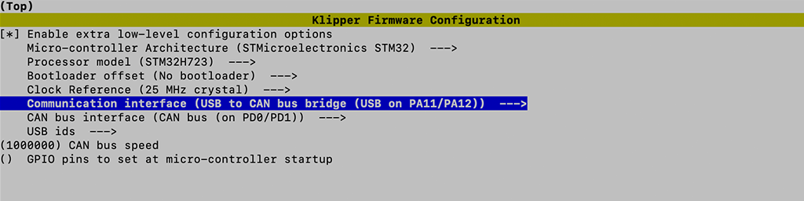

# H723 CAN Bridge

### Config Firmware

Use the command below to enter the firmware configuration interface.

```shell
cd ~/klipper
make clean
make menuconfig
```



#### Compile Firmware

```shell
make 
```

### Flash Firmware

Short the Boot0 jumper then press the reset button. Use `lsusb` commend to check. 

```
Bus 001 Device 001: ID 0483:df11 STMicroelectronics STM Device in DFU Mode
```

Use the commend below to flash firmware into mcu.

```shell
make flash FLASH_DEVICE=0483:df11
```

### Find CANBUS UUID

#### [Config Linux CAN Network](../../../host/can-network/config-linux-can-network.md) before move on.

Use the commend below to find `canbus_uuid`

```shell
~/klippy-env/bin/python ~/klipper/scripts/canbus_query.py can0
```

If uninitialized CAN devices are detected the above command will report lines like the following:

```shell
Found canbus_uuid=11aa22bb33cc, Application: Klipper
```

### Configuring Klipper

Update the Klipper mcu configuration in `printer.cfg` to use the CANBUS communicate with mcu.

```python
[mcu]
canbus_uuid: 11aa22bb33cc
```
