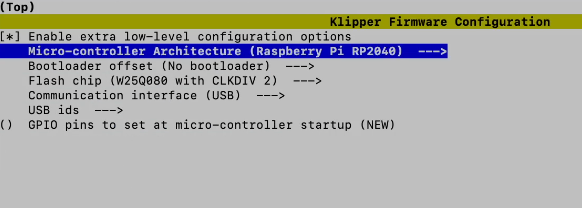

# RP2040

### Config Firmware

Use the command below to enter the firmware configuration interface.

```shell
cd ~/klipper
make clean
make menuconfig
```



#### Compile Firmware

```shell
make 
```

### Flash Firmware

Short the Boot jumper then press the reset button. Use `lsusb` commend to check. 

```shell
Bus 001 Device 001: ID 2e8a:0003 Raspberry Pi RP2 Boot
```

Use the commend below to flash firmware into mcu.

```shell
make flash FLASH_DEVICE=2e8a:0003
```

### Find Serial ID

Use the commend below to find Serial ID for rp2040

```shell
ls /dev/serial/by-id/*
```

Then it will show the Serial ID 

```shell
/dev/serial/by-id/usb-Klipper_rp2040_neko-if00
```

### Configuring Klipper

Update the Klipper mcu configuration in `printer.cfg`

```python
[mcu]
serial: /dev/serial/by-id/usb-Klipper_rp2040_neko-if00
```
